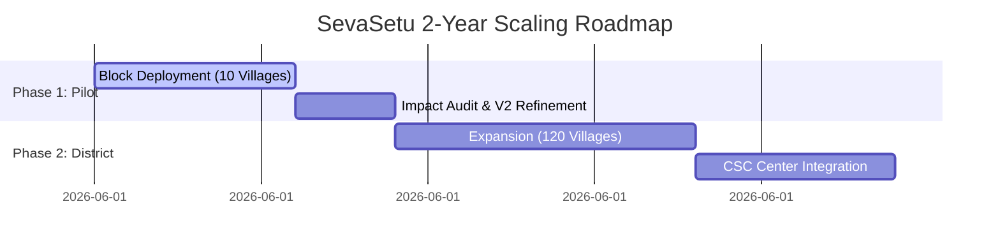

# SevaSetu (सेवासेतु) — 2-Year Impact Projection & Socio-Economic Analysis

**Prepared By**: Economic Research & Social Policy Division  
**Document Class**: Policy Impact Assessment (2-Page Briefing)  

---

## 1. Context & Socio-Economic Challenge
In India, the central and state governments spend billions of rupees on direct benefit transfers (DBT) and welfare schemes. However, **information asymmetry** and administrative hurdles prevent millions of eligible rural citizens from accessing these benefits. 

Traditional access methods suffer from:
1. **Middlemen Leakage**: Unofficial brokers charging commission fees (ranging from ₹500 to ₹5,000) to check eligibility and compile forms.
2. **Wage Loss & Travel Cost**: Citizens spending ₹150–₹400 on bus travel to administrative hubs (Panchayat offices/Common Service Centres) and losing a day's agricultural wage (₹300–₹500) just to query scheme availability.
3. **Application Rejection**: Over 20% of applications are rejected due to mismatched or missing documentation.

**SevaSetu** resolves this bottleneck by placing a free, RAG-grounded, voice-enabled eligibility calculator and document checklists directly in the hands of citizens.

---

## 2. Direct-to-Citizen Financial Savings Model

By moving the search, eligibility validation, and document gathering online with AI assistance, a typical rural family experiences immediate, quantifiable cost reductions:

| Expense Category | Traditional Method Cost (per scheme) | SevaSetu Method Cost (per scheme) | Net Savings per Query |
|---|---|---|---|
| **Travel (Round Trip)** | ₹200 (2 visits to Block office) | ₹0 (Digital lookup) | **₹200** |
| **Daily Wage Loss** | ₹800 (2 days of missed labor) | ₹0 (Done during evening) | ****₹800** |
| **Middleman Commission** | ₹1,500 (Assistance fee) | ₹0 (AI RAG guide) | **₹1,500** |
| **Documentation Errors** | ₹300 (Re-submission/Printing) | ₹50 (Verified checklist) | **₹250** |
| **Total Out-of-Pocket** | **₹2,800** | **₹50** | **₹2,750** |

> [!TIP]
> *For a marginal farmer or wage laborer, saving ₹2,750 represents approximately **7 to 9 days of additional household sustenance**.*

---

## 3. Two-Year Adoption & Scaling Model

This model projects the deployment of SevaSetu in rural Karnataka and Uttar Pradesh, starting with a pilot block of 10 villages and expanding to district-level operations over 24 months.

### Metrics Projections Table

| Metric | Month 6 (Pilot Phase) | Month 12 (Scale-up) | Month 24 (District Level) |
|---|---|---|---|
| **Active Villages Reached** | 10 Villages | 45 Villages | 120 Villages |
| **Active Monthly Users** | 3,500 | 18,000 | 75,000 |
| **Queries Resolved (AI Chat)**| 12,000 | 85,000 | 450,000 |
| **Eligibility Wizard Runs** | 5,000 | 32,000 | 180,000 |
| **Cumulative Financial Savings**| ₹1.37 Lakhs | ₹12.5 Lakhs | ₹55.0 Lakhs |
| **Direct Benefits Disbursed** | ₹12 Lakhs | ₹85 Lakhs | ₹4.2 Crores |

---

## 4. Qualitative Impact & Social Policy Alignment

Beyond numbers, SevaSetu drives structural shifts in how citizens interact with civic tech:

### 1. Gender-Equitable Scheme Access
Rural women often rely on male relatives to visit municipal offices, restricting their agency. SevaSetu's voice-enabled Tamil and Hindi guidance provides private, direct access to schemes like *Sukanya Samriddhi Yojana* and *Pradhan Mantri Ujjwala Yojana*. This increases uptake among women heads-of-households.

### 2. Elimination of Information Gaps
Government rules change frequently. By dynamically updating the local JSON database (`schemes_db.json`) fed into the RAG model, the chatbot ensures citizens do not rely on outdated flyers or rumors, reducing administrative disputes.

### 3. Lowering the Literacy Barrier
Conventional interfaces rely on typing search strings. Our implementation of Web Speech recognition and local language audio feedback turns speech-to-text and text-to-speech, bringing first-class digital utility to illiterate citizens.

---

## 5. Implementation & Scaling Strategy

To achieve these projections, the project will utilize two primary scaling vectors:

1. **Common Service Centre (CSC) Partnerships**: Install SevaSetu kiosks at Panchayat offices to act as the primary self-service lookup station.
2. **WhatsApp Business API Gateway**: Since the Express backend is structured around simple JSON payloads (`/api/chat` and `/api/eligibility`), the system can easily be routed through a WhatsApp chatbot number in a future release, reaching users without requiring app installations.
