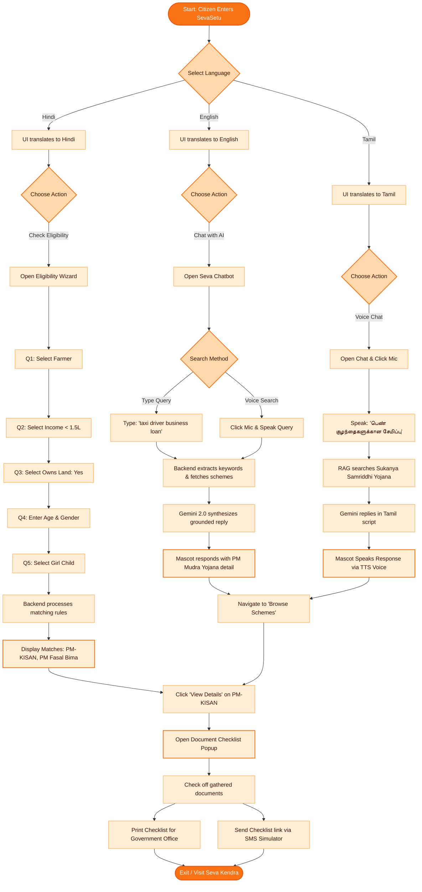

# SevaSetu (सेवासेतु) — User-Flow Journeys & Diagrams

This document visualizes and maps out the user experience on the **SevaSetu** platform for three distinct target personas representing typical rural and semi-urban Indian citizens.

---

## 👥 Target Personas

### 🌾 Persona 1: Ramesh Kumar (The Rural Farmer)
- **Profile**: 48-year-old marginal farmer.
- **Location**: Hardoi, Uttar Pradesh.
- **Language**: Hindi (हिंदी).
- **Literacy & Tech Savviness**: Primary school education; comfortable using WhatsApp for voice notes but struggles with text inputs and complex web navigations.
- **Core Need**: Discover agricultural financial aid schemes (e.g., crop subsidies, direct benefit transfers) to purchase fertilizers for the upcoming season.

### 🚕 Persona 2: Arjun Selvam (The Gig Worker / Cab Driver)
- **Profile**: 29-year-old gig-economy taxi driver.
- **Location**: Chennai, Tamil Nadu.
- **Language**: Tamil (தமிழ்) & Conversational English.
- **Literacy & Tech Savviness**: High school graduate; uses Android apps daily for navigation and payment gateways.
- **Core Need**: Secure low-interest credit to repair his vehicle and expand his driving services (e.g., Pradhan Mantri Mudra Yojana).

### 👵 Persona 3: Lakshmi Devi (Woman Head-of-Household & Rural Artisan)
- **Profile**: 38-year-old weaver and single mother of a 7-year-old daughter.
- **Location**: Rural outskirts of Madurai, Tamil Nadu.
- **Language**: Tamil (தமிழ்).
- **Literacy & Tech Savviness**: Semi-literate; highly dependent on voice search and audio feedback.
- **Core Need**: Secure clean cooking energy (LPG connection) and start a long-term savings fund for her daughter's education (e.g., Sukanya Samriddhi Yojana).

---

## 🗺️ Master User Flow Diagram

The following Mermaid diagram maps out how all three personas navigate the SevaSetu platform based on their capabilities and needs:

---

## 🏃‍♂️ Step-by-Step Persona Journeys

### 1. Ramesh's Journey (Interactive Eligibility Calculator)
1. **Entry**: Ramesh opens the app on his phone. The interface defaults to English.
2. **Language Configuration**: He doesn't read English well. He clicks the ⚙️ **Settings** icon on the top right, selects **हिंदी (Hindi)**, and clicks **Save**. The interface instantly translates.
3. **Navigating to Wizard**: Ramesh clicks the **🎯 योग्यता जांचें (Check Eligibility)** tab.
4. **Answering Questions**:
   - *Question 1 (Occupation)*: He selects **किसान / भूमि मालिक (Farmer / Landowner)**.
   - *Question 2 (Income)*: He selects **₹1.5 लाख से कम (Less than 1.5L)**.
   - *Question 3 (Land)*: He selects **हाँ (Yes)**.
   - *Question 4 (Age/Gender)*: He types `48` and selects **पुरुष (Male)**.
   - *Question 5 (Girl Child)*: He selects **नहीं (No)**.
5. **Results Generation**: Ramesh clicks **मेरी योजनाएं खोजें (Find My Schemes)**. The API returns **PM-KISAN** and **PM Fasal Bima Yojana**.
6. **Obtaining Checklist**: He clicks **विवरण देखें (View Details)** under PM-KISAN. A modal pops up in Hindi showing the required documents (Aadhaar Card, Land Registry, Bank Passbook). He prints this checklist to carry to the local CSC (Common Service Centre).

### 2. Arjun's Journey (RAG Conversational Assistant)
1. **Entry**: Arjun loads SevaSetu on his smartphone. He keeps the language set to English.
2. **AI Chat Query**: He stays on the **💬 Seva Chatbot** tab.
3. **Typing Question**: He inputs: *"How can I get a loan to repair my taxi cab under government schemes?"* and clicks **Send**.
4. **Backend RAG Processing**: The API extracts terms: `loan`, `taxi`, `repair`. It fetches the **Pradhan Mantri Mudra Yojana (PMMY)** schema details from the database.
5. **Gemini Grounding**: The Gemini model synthesizes a reply explaining that PMMY Shishu/Kishore loans cover vehicle purchasing/repairing.
6. **Resolution**: The assistant shows the benefits (up to ₹10 Lakhs, no collateral). Arjun navigates to **Browse Schemes**, selects **PM Mudra Yojana**, inputs his mobile number, and triggers a mock SMS to his phone with the list of documents (business proof, vehicle registration, quota quote).

### 3. Lakshmi's Journey (Multilingual Voice I/O)
1. **Entry**: Lakshmi accesses the prototype from a tablet at a community center.
2. **Language Selection**: A volunteer switches the language to **தமிழ் (Tamil)**.
3. **Voice Input**: Lakshmi is semi-literate, so she clicks the 🎤 button. She says: *"பெண் குழந்தைகளுக்கான சேமிப்பு திட்டம் என்ன?"* (What is the savings scheme for a girl child?)
4. **Server Lookup**: The Web Speech API transcribes the Tamil speech. The chatbot sends the text to the backend. The backend matches the query with **Sukanya Samriddhi Yojana (SSY)**.
5. **Dynamic Narration**: The assistant responds in Tamil text. Lakshmi clicks the 🔊 button. The system reads the response aloud in a clear Tamil accent: *"சுகன்யா சம்ரித்தி யோஜனா திட்டத்தின் கீழ் நீங்கள் உங்கள் பெண் குழந்தைக்கு சேமிப்புக் கணக்கு தொடங்கலாம்..."*
6. **Document Verification**: She clicks **விவரங்களைக் காட்டு (View Details)**. A modal pops up listing Aadhaar of the child, Birth Certificate, and Mother's ID. As she gathers her physical documents, she checks them off on the screen and prints the list.
